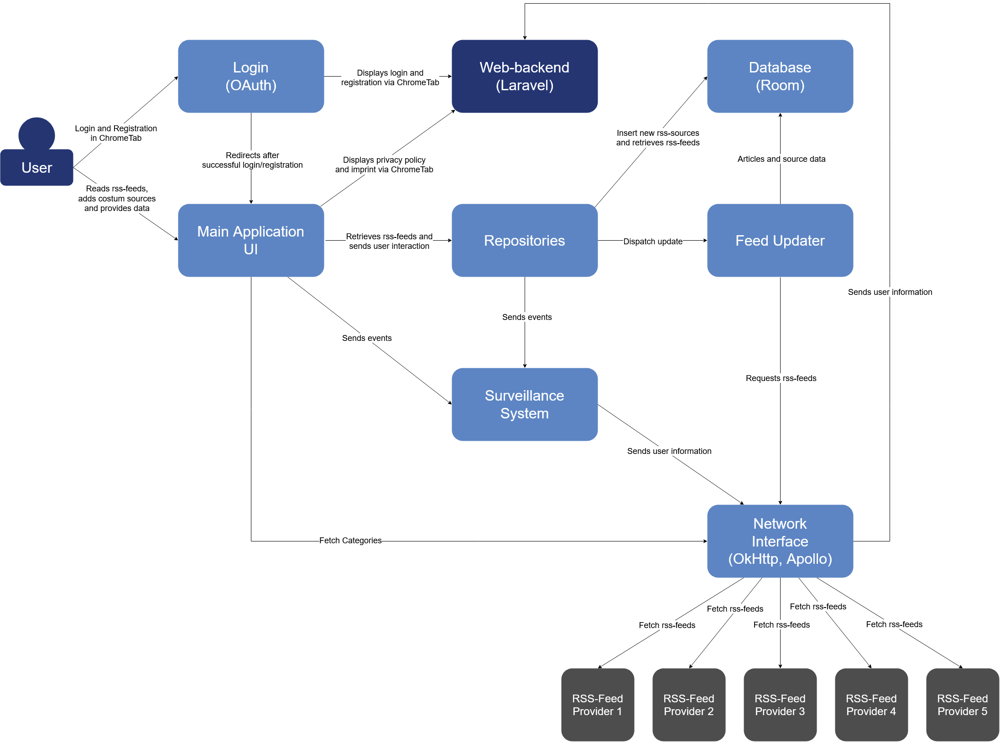
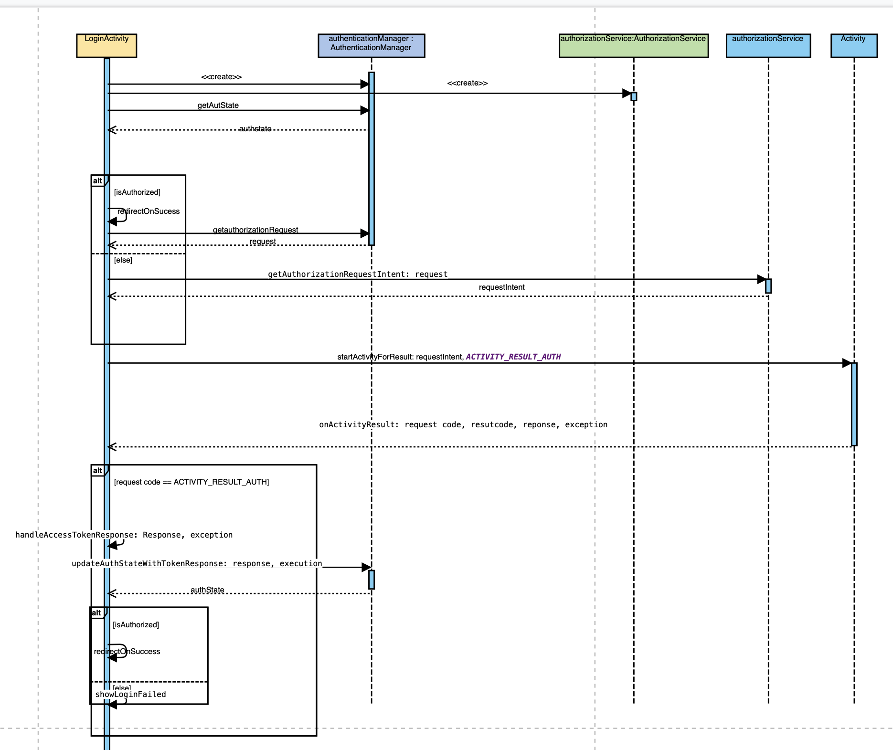
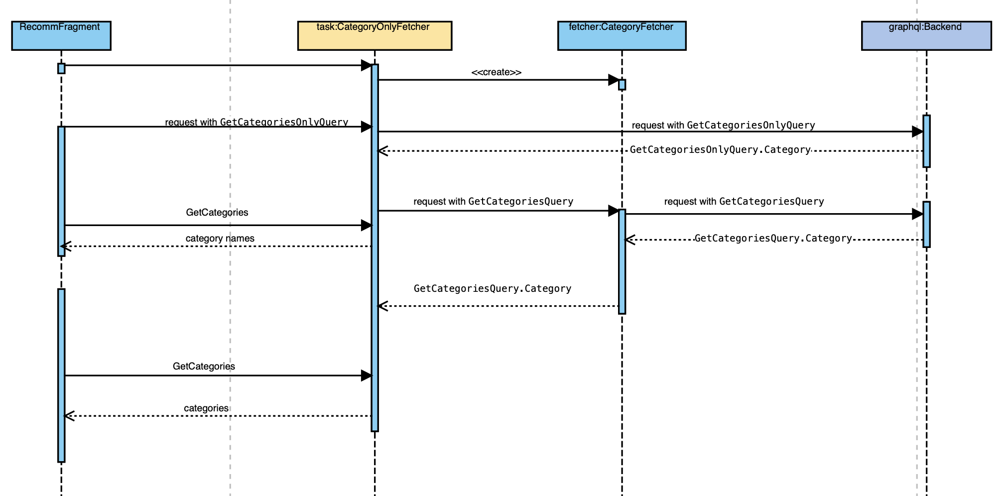
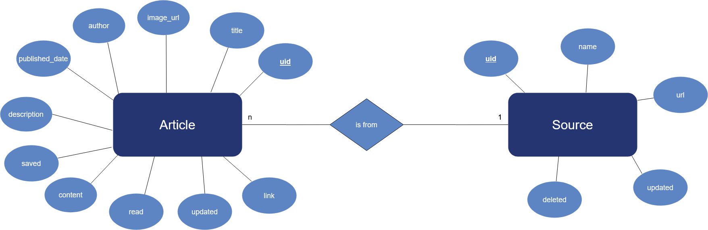

# Android application components
## Overview

## Description
The application is divided in multiple components who provide different services.

### Login

The Login is implemented using [Android-AppAuth](https://github.com/openid/AppAuth-Android) and is handled in the [AuthenticationManager](./codedoc/classde_1_1datenkraken_1_1datenkrake_1_1authentication_1_1_authentication_manager.html) and the [LoginActivity](./codedoc/classde_1_1datenkraken_1_1datenkrake_1_1ui_1_1login_1_1_login_activity.html). The `AuthenticationManager` is mainly used to store/load the current authentication state and access it. The AuthManager will be updated with any new state from within the LoginActivity, when the user starts an authorization flow.

The library is responsible for starting / processing the OAuth flow, which is the protocol used for user authentication. Read more about OAuth in the Backend [here](/documentation/web_backend/#oauth).

### Main Application UI
The ui provides an interface for the user to interact with. All the UI elements consist of a [Fragment](https://developer.android.com/guide/components/fragments) 
and a [ViewModel](https://developer.android.com/reference/androidx/lifecycle/ViewModel). 

The Fragment is used to display the layout of the element and handle the interactions with the UI. The ViewModel provides data and handles the interaction logic with the rest of the application. The Fragment subscribes on the provided data via Androids LiveData concept to display changes immediately.

Navigation is implemented in the [MainActivity](./codedoc/classde_1_1datenkraken_1_1datenkrake_1_1_main_activity.html) via the library [navigation](https://developer.android.com/guide/navigation). This library is able to switch out the Fragments displayed, for example, when a menu item is pressed.

Part of the ui is the [category recommendation system](./codedoc/namespacede_1_1datenkraken_1_1datenkrake_1_1ui_1_1recommendation.html). It helps users by recommending various [Source](./codedoc/classde_1_1datenkraken_1_1datenkrake_1_1model_1_1_source.html)s in different categories. Showcasing and visualizing an example for the communication between UI, Network Interface and Backend:

### Repositories
The repositories provide an interface to interact with the database and FeedUpdater. 
It is divided into two classes, the [ArticleRepository](./codedoc/classde_1_1datenkraken_1_1datenkrake_1_1repository_1_1_article_repository.html), responsible for interactions related to articles and the [SourceRepository](./codedoc/classde_1_1datenkraken_1_1datenkrake_1_1repository_1_1_source_repository.html), 
responsible for interactions related to sources.

The ArticleRepository is used to update, delete and retrieve articles from the database and to clear the cache.
The SourceRepository is used to retrieve, insert and delete sources from the database. Updon deletion it removes unsaved articles.

### Database
For the database we use the [Room library](https://developer.android.com/topic/libraries/architecture/room). It provides [annotations](https://developer.android.com/reference/android/arch/persistence/room/package-summary) that can be used to annotate models and functions. In [Article](./codedoc/classde_1_1datenkraken_1_1datenkrake_1_1model_1_1_article.html) and [Source](./codedoc/classde_1_1datenkraken_1_1datenkrake_1_1model_1_1_source.html), such annotations can be seen above the class and variable definitions. The [Daos](https://developer.android.com/training/data-storage/room/accessing-data), such as [DaoArticle](./codedoc/classde_1_1datenkraken_1_1datenkrake_1_1db_1_1_dao_article.html), contain functions that have also been annotated. Daos provide interfaces for accessing the database. DaoArticle contains functions to access the articles in the database.

Room is based on the fact that it generates code from classes, variables and functions that have been provided with room annotations, which has the corresponding functionality to access the database. A central component is the [AppDatabase](./codedoc/classde_1_1datenkraken_1_1datenkrake_1_1db_1_1_app_database.html), which inherits directly from the [RoomDatabase](https://developer.android.com/reference/androidx/room/RoomDatabase) and contains all daos. The database models are also referenced via annotations in AppDatabase.

[DatabaseConverters](./codedoc/classde_1_1datenkraken_1_1datenkrake_1_1db_1_1_database_converters.html) is a class providing converters that are needed by Room to convert objects such as Date into a type that can be stored in the database. The class is also referenced as an annotation in AppDatabase.

As an entity-relationship model, the database looks like this:

For further information, please see [Room Documentation](https://developer.android.com/topic/libraries/architecture/room).

### Feed Updater
The [FeedUpdateManager](./codedoc/classde_1_1datenkraken_1_1datenkrake_1_1controller_1_1feedupdater_1_1_feed_update_manager.html) reacts to changes in the database and accordingly downloads articles or cancels ongoing downloads. To do this, it subscribes to all sources in the database and reacts as soon as the status of these changes. It also checks automatically after a certain period of time whether sources need to be updated.

The FeedUpdateManager uses the [FeedUpdater](./codedoc/classde_1_1datenkraken_1_1datenkrake_1_1controller_1_1feedupdater_1_1_feed_updater.html) which is responsible for the management of running downloads.

If a source needs to be updated, an [OkHttpFeed](./codedoc/classde_1_1datenkraken_1_1datenkrake_1_1controller_1_1feedupdater_1_1rss_1_1_ok_http_feed.html) is instantiated with the source url. The OkHttpFeed describes the task of downloading a feed and is able to parse it with the help of the Rome Library. [Jsoup](https://jsoup.org/apidocs/) is also used to extract images and remove any trackers.

### Network Interface
The network interface has different central classes and can be extended modularly by further so-called "clients". [Client](./codedoc/classde_1_1datenkraken_1_1datenkrake_1_1network_1_1clients_1_1_client.html)s are the network interfaces of different libraries which can be used. This currently includes the [OkHttp library](https://square.github.io/okhttp/) and [Apollo library](https://github.com/apollographql/apollo-android) in the app.

The [ITasks](./codedoc/interfacede_1_1datenkraken_1_1datenkrake_1_1network_1_1_i_task.html) are generic network tasks that are processed by clients. The task specifies the client by which it wants to be processed and gets distributed by [request(ITask)](./codedoc/classde_1_1datenkraken_1_1datenkrake_1_1network_1_1_task_distributor.html#a66f232cd9d73be08596ed29b4527f88a) in the [TaskDistributor](./codedoc/classde_1_1datenkraken_1_1datenkrake_1_1network_1_1_task_distributor.html) to different clients. The TaskDistributor revieve these clients via [getClient(Class<? extends Client<? extends ITask >>)](./codedoc/classde_1_1datenkraken_1_1datenkrake_1_1network_1_1_client_provider.html#a1e4465676c266c8246cb4b6da1373b94) from the [ClientProvider](./codedoc/classde_1_1datenkraken_1_1datenkrake_1_1network_1_1_client_provider.html).

The ClientProvider has a list of all clients that have already been instantiated. If it is to return a client that has not yet been instantiated, it instantiates it dynamically using Java's [Reflection package](https://docs.oracle.com/javase/8/docs/api/java/lang/reflect/package-summary.html).

### Surveillance
See: [Surveillance](./surveillance.md)