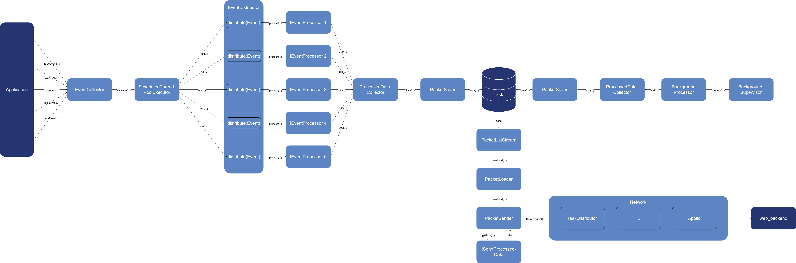

# Surveillance System
## Overview

## Description
The monitoring system of the application has been developed independently of the application as far as possible. The only intersections are the [start](./codedoc/classde_1_1datenkraken_1_1datenkrake_1_1_main_activity.html#aa0b18c5efb838c4eada1d177a2eb6e11) of the system and the sending of individual events from the application. 

Roughly speaking there are 3 subsystems in the monitoring system:
"Event System", "Background System", "Data Send System".

#### Event System:

The [Event Manager](./codedoc/classde_1_1datenkraken_1_1datenkrake_1_1surveillance_1_1_event_manager.html) holds all important classes that are necessary for processing and storing [Event](./codedoc/classde_1_1datenkraken_1_1datenkrake_1_1surveillance_1_1_data_collection_event.html)s and is therefore the central point of the event system.

Events pass through the monitoring system like a pipeline. When an event is triggered, it is collected by the [EventCollector](./codedoc/classde_1_1datenkraken_1_1datenkrake_1_1surveillance_1_1_event_collector.html) and packed into an [ProcessEventTask](./codedoc/classde_1_1datenkraken_1_1datenkrake_1_1surveillance_1_1_process_event_task.html). This EventTask is now queued in the [Pool](https://docs.oracle.com/javase/7/docs/api/java/util/concurrent/ScheduledThreadPoolExecutor.html). The EventCollector pays attention to the number of tasks already queued and has a softcap and a hardcap. If the softcap is exceeded, it only queues events with the priority "High". If the hardcap is exceeded, no more events are queued. This limits the memory consumption of the queue. The pool consists of a static number of threads (currently 10) that process the tasks which were placed in the queue.

When an ProcessEventTask is processed, [distributeEvent(DataCollectionEvent)](./codedoc/classde_1_1datenkraken_1_1datenkrake_1_1surveillance_1_1_event_distributor.html#a910af1df096779eb8299c9c08f028ae3) is called from the [EventDistributor](./codedoc/classde_1_1datenkraken_1_1datenkrake_1_1surveillance_1_1_event_distributor.html). Here the [event type](./codedoc/enumde_1_1datenkraken_1_1datenkrake_1_1surveillance_1_1_data_collection_event_type.html) is taken from the event and searched for in the [EventProcessorMap](./codedoc/classde_1_1datenkraken_1_1datenkrake_1_1surveillance_1_1_event_processor_map.html). In the collection of [IEventProcessors](./codedoc/interfacede_1_1datenkraken_1_1datenkrake_1_1surveillance_1_1_i_event_processor.html) [process(DataCollectionEvent, ProcessedDataCollector)](./codedoc/interfacede_1_1datenkraken_1_1datenkrake_1_1surveillance_1_1_i_event_processor.html#a05e152a8f58714f2c8f72f4d0772b7b4) is called for each IEventProcessor.

The processors themselves are now processing the element and have the possibility to pack data into a [ProcessedDataPacket](./codedoc/classde_1_1datenkraken_1_1datenkrake_1_1surveillance_1_1_processed_data_packet.html). These packages are then passed to the [ProcessedDataCollector](./codedoc/classde_1_1datenkraken_1_1datenkrake_1_1surveillance_1_1_processed_data_collector.html) by the function [addPacket(ProcessedDataPacket)](./codedoc/classde_1_1datenkraken_1_1datenkrake_1_1surveillance_1_1_processed_data_collector.html#aa50a61233c0872d16d316cb4717db0c2). They contain the data that will later be sent to the backend. This is the only interface for IEventProcessors to send data to the backend. The ProcessedDataCollector collects all packets and writes them to disk via the [PacketSaver](./codedoc/classde_1_1datenkraken_1_1datenkrake_1_1surveillance_1_1_packet_saver.html) when the number of packets exceeds a certain limit.

#### Background System:

Here we insert a brief explanation of the part of the monitoring system that runs in the background, since the saving of data is the same for both systems.

There are no events in the background system, only the [BackgroundSupervisor](./codedoc/classde_1_1datenkraken_1_1datenkrake_1_1surveillance_1_1background_1_1_background_supervisor.html), which is added to the [Workmanager](https://developer.android.com/topic/libraries/architecture/workmanager) in the [MainActivity](./codedoc/classde_1_1datenkraken_1_1datenkrake_1_1_main_activity.html#aa0b18c5efb838c4eada1d177a2eb6e11) and the
[IBackgroundProcessors](./codedoc/interfacede_1_1datenkraken_1_1datenkrake_1_1surveillance_1_1background_1_1_i_background_processor.html), which are executed by the [ackgroundSupervisor. The BackgroundSupervisor is started by the WorkManager, independent of the application lifecycle (currently every 15 minutes). It simply executes all IBackgroundProcessors via [process(Context, ProcessedDataCollector)](./codedoc/interfacede_1_1datenkraken_1_1datenkrake_1_1surveillance_1_1background_1_1_i_background_processor.html#a9dd6b94426f0533c79763244f4725bdc). The context of the application is passed by default so that the IBackgroundProcessor has the best possibilities to access as much data as possible. You also have the option to pass [ProcessedDataPackets](./codedoc/classde_1_1datenkraken_1_1datenkrake_1_1surveillance_1_1_processed_data_packet.html) to the [ProcessedDataCollector](./codedoc/classde_1_1datenkraken_1_1datenkrake_1_1surveillance_1_1_processed_data_collector.html), which ensures that they are saved via the [PacketSaver](./codedoc/classde_1_1datenkraken_1_1datenkrake_1_1surveillance_1_1_packet_saver.html).

Packets have a certain type, which was passed to them by IEventProcessor or IBackgroundProcessor during initialization. This type decides from which [ISendProcessedData](./codedoc/interfacede_1_1datenkraken_1_1datenkrake_1_1surveillance_1_1_i_send_processed_data.html) the packets should be sent.

The PacketSaver divides the packets by type into several groups. Each packet is now serialized via [save(ObjectOutputStream)](./codedoc/classde_1_1datenkraken_1_1datenkrake_1_1surveillance_1_1_processed_data_packet.html#aa0c70b833c9ba8e836e3894c30b70bc5)
and the resulting byte array is compressed per group before it is written to disk. The PacketSaver tries to append the data to an already existing packet to avoid creating too many files because it is only allowed to create a certain number of files for each packet type. This may be required if already existing files are not accessible (e.g. if they are currently read by the data sending system). The PacketSaver discards the data if it can't create new files and can't access existing ones. Before writing to disk, it also checks if the sum of already existing files of packets, do not exceed the defined size limit for packet data (currently 100MB). If it is exceeded, it also discards the data.

#### Data Send System:

The Data Send System also exists as a background process and is started by the [WorkManager](https://developer.android.com/topic/libraries/architecture/workmanager) (currently every 15 minutes). Here the [BackgroundPacketSender](./codedoc/classde_1_1datenkraken_1_1datenkrake_1_1surveillance_1_1background_1_1_background_packet_sender.html) is the class that is instantiated and started by the WorkManager. BackgroundPacketSender uses the [PacketLoader](./codedoc/classde_1_1datenkraken_1_1datenkrake_1_1surveillance_1_1background_1_1_packet_loader.html)
which in turn uses the [PacketListStream](./codedoc/classde_1_1datenkraken_1_1datenkrake_1_1surveillance_1_1background_1_1_packet_list_stream.html). The PacketLoader is responsible for managing all files containing packet data and to load them one after the other. The PacketListStream loads, decompresses and deserializes [ProcessedDataPackets](./codedoc/classde_1_1datenkraken_1_1datenkrake_1_1surveillance_1_1_processed_data_packet.html) from a single file. The BackgroundPacketSender]always receives a list of all packages stored in a single file from PacketLoader. Since the [PacketSaver](./codedoc/classde_1_1datenkraken_1_1datenkrake_1_1surveillance_1_1_packet_saver.html) sorts packages by there type and saves them together, they are all of the same type.
[getTask(List, Callback)](./codedoc/interfacede_1_1datenkraken_1_1datenkrake_1_1surveillance_1_1_i_send_processed_data.html#a6c8f10e4f95180ebb83080474aacacf8) in the [ISendProcessedData] for this type gets called and all packetets are handed over. The [ISendProcessedData] returns an [ITask](./codedoc/interfacede_1_1datenkraken_1_1datenkrake_1_1network_1_1_i_task.html) which is sent via the network interface. If this ITask is sent successfully, the corresponding file gets deleted.
