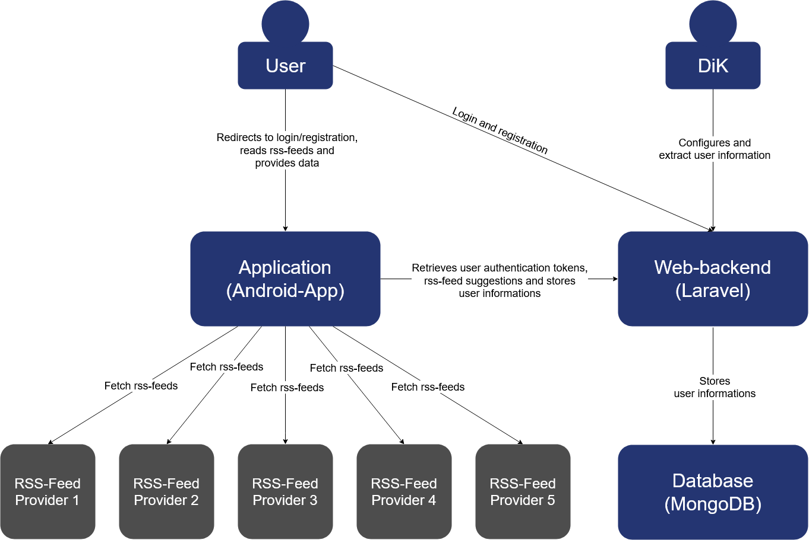

# Datenkrake Structure
## Overview

## Description

Datenkrake is divided into 3 main parts: android-application, web-backend and 
database. Each of them using different technologies best suited for their purpose.

### Android-Application

The Android-Application is the main entrypoint for our users. Upon first time
use, users will have to step through a small setup consisting of 
registration/login and an optional selection of suggested source that best
fit their interests. The application will display the registration webpage 
and login page in a ChromeTab to provide them a seamless user experience.

After these setup steps they are able to read rss-feeds and manage there 
rss-sources. In order to do this the application communicates with rss-providers
that were added by the user to fetch rss-feeds. At the same time, the application will
try to gather as much data as possible about the user and the device. The 
gathered data will be send to our web-backend.

See: [Android-Application](./app/)

### Backend

The backend has two main functions. The first is to accept data
from the app and then later store that data in the database. For the interface
we use GraphQL. The second function is the admin dashboard where admins 
can manage the settings for the current experiment and view data 
that has already been collected. Admins like the DiK can configure suggested
sources, privacy policy and the imprint and to display aggregated user
informations, all from the dashboard. All of this is built with Laravel,
a PHP-framwork. The backend also provides the authorization service which
is usgin OAuth to authenticate users of our app. 

See: [Web-backend](./web_backend/)

### Database
To store all of our data we use MongoDB. This enables us to not worry about database
design and instead focus on collecting data. Laravel provides the benefit of abstracting
over the database, and since Laravel is used for the data management it is the only client
that has to connect to the database. This also enables us to not expose the database to
the internet and instead access it internally.

See: [Database](./database.md)