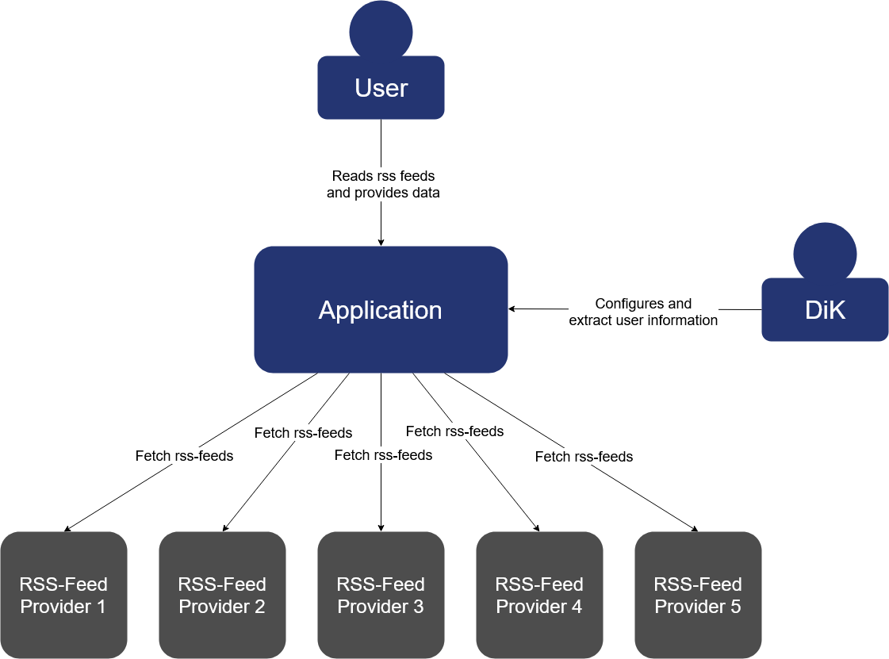

# Datenkrake
## Overview

## Datenkrake...
is an application bundle to that is designed to be an experiment about how much
data can be gathered about a person using a android application without their 
knowledge. To test how much data can be gathered, Datenkrake includes an android app
which, provides users the default experience of a [RSS](https://en.wikipedia.org/wiki/RSS) reader. While the app is installed
gather various user interactions and information about the device are sent to the 
backend for analysis.

Users can choose from a range of suggested RSS-feeds and are able to add custom 
ones, according to their interests. The App will download the feeds, save and display
them to the user. While users interact with the App, their information is sent to the
backend.

While regular users interact with the App, admins can monitor their behaviour in
the backend dashboard. In this case the 
[DiK](https://www.dik.tu-darmstadt.de/fachgebiet_dik/index.de.jsp) acts as the admin.
Admins are able to view the collected information, manage users and administer other
settings that are relevant for the experiment.
