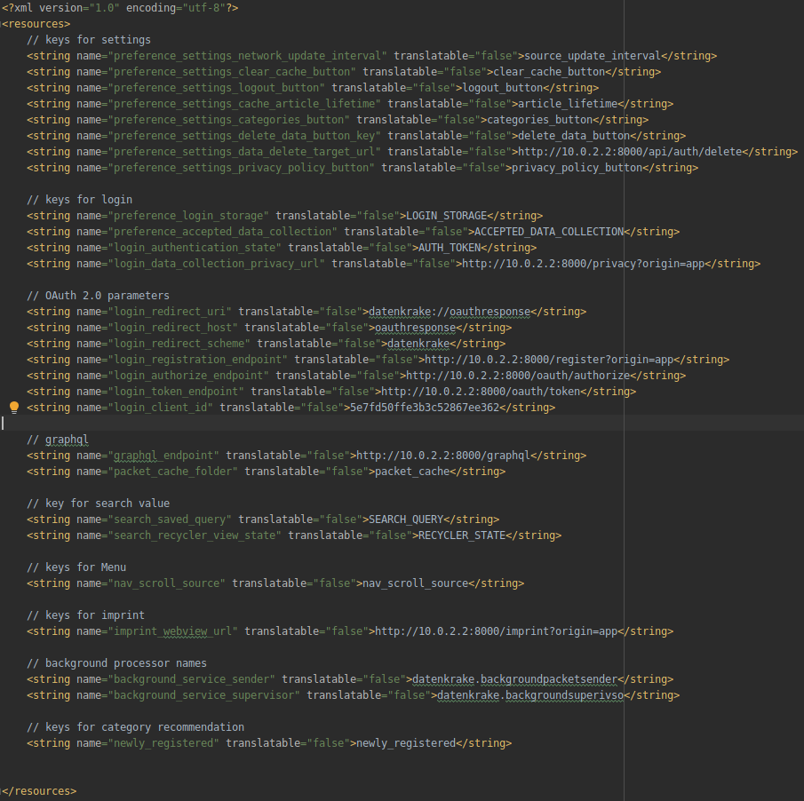

# Setup the project

## Setting up the Backend
You will first need to setup the backend and have it up and running.  
We have provided a guide on how to do this for your [local development setup here](/guides/backend/development-setup) and another one for your [production setup here](/guides/backend/production-setup).

## Connecting the App to the Backend

### Creating an OAuth client
After you have successfully setup the backend, you should login with your admin account and go to "Manage OAuth" in the dashboard. 

There you can create a new client, that will be used to identify the App as a valid OAuth client. It is needed, to provide the login functionality of the App and the whole authorization process with the Backend.

!!! warning "Make sure to unselect the "confidential" checkbox"
    As we need a so called "public" client, that cannot be trusted with a secret. Otherwise the login **will not work**.

Choose a trustworthy name for the application, that the users can recognize and enter a redirect URI (we recommend using `datenkrake://oauthresponse`).

### Adjust the App configuration

Now you will need to adjust the configuration of the App and fill in the new information about the newly created client.

Go to `app/src/main/res/values/strings.xml` and edit the values as described below:

!!! warning "Replace all occurences of `http://10.0.2.2:8000` with the location of your backend."
    The location depends on your environment, `10.0.2.2` for example is the address of your own host machine from within the android emulator. But in production this should be changed to the location of your backend with `https` in front.

*An example of the strings.xml file*

Copy the client ID from the dashboard into the `login_client_id` field and if you used another redirect URI, make sure to adjust `login_redirect_uri`, `login_redirect_host` and `login_redirect_scheme` respectively.

## Build App / Use it

Now you can run the app from Android Studio or build the APK using the guide found [here](/guides/app/build-apk) and distribute / install it on your device and everything should be up and running.